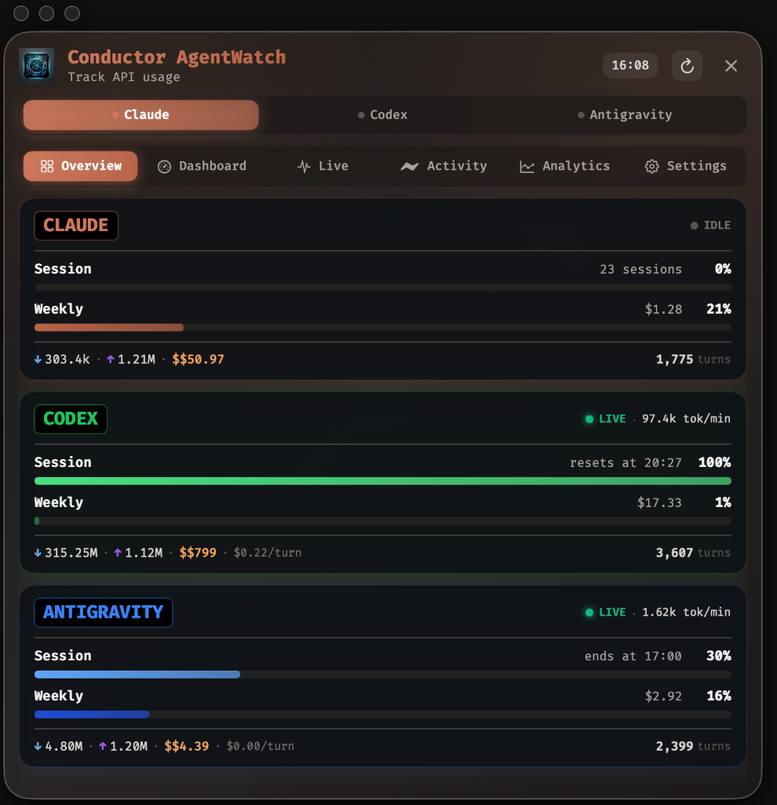
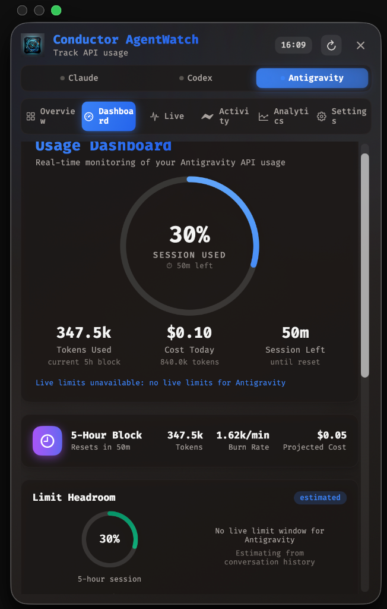
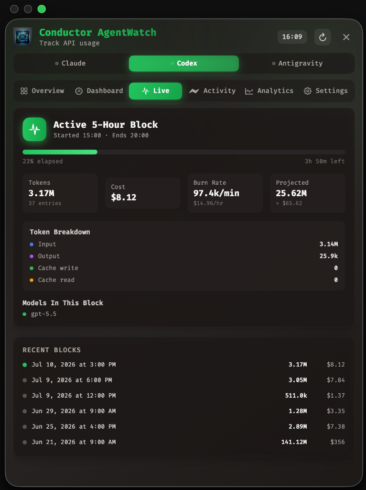
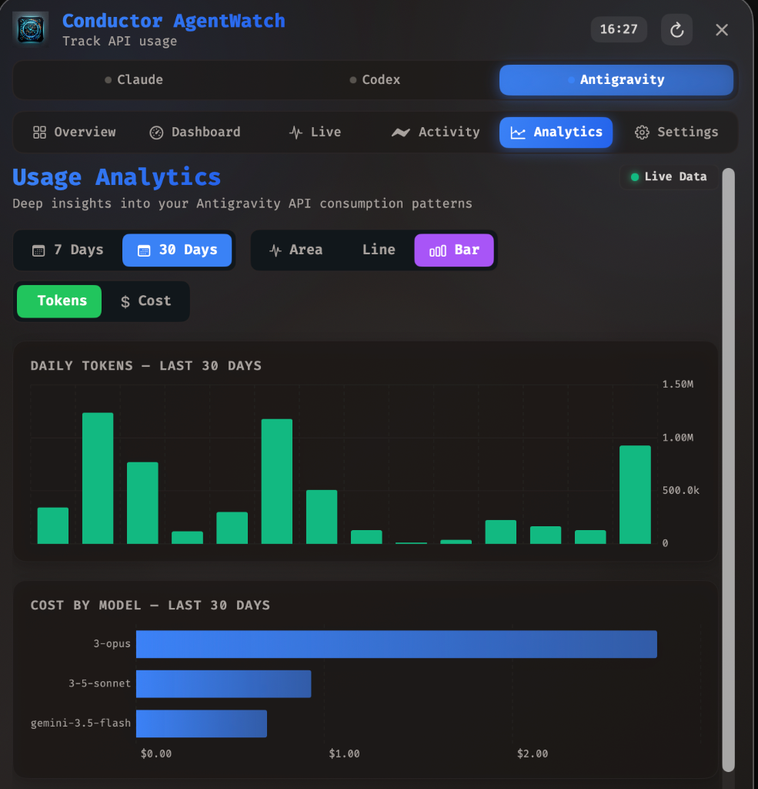
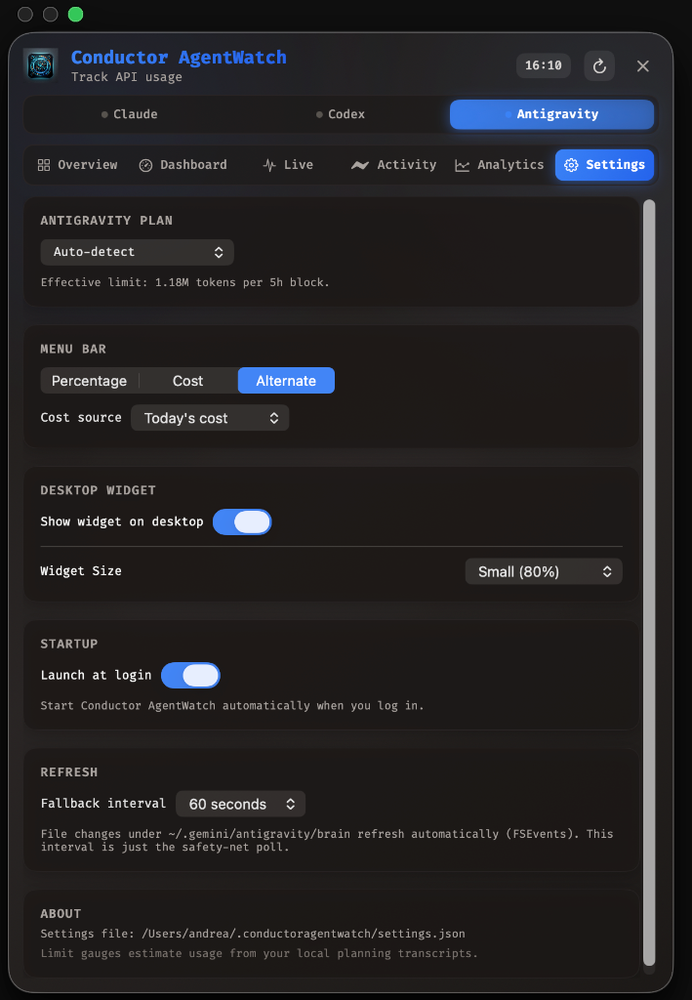

# Conductor AgentWatch 🤖

[](https://opensource.org/licenses/MIT)
[](https://developer.apple.com/macos/)

A lightweight, **native Swift** macOS menu bar app for tracking your Claude Code, Codex, and Antigravity usage in real-time. Monitor token consumption, costs, session blocks, and server-side limits with a premium, monospaced native interface.

Conductor AgentWatch runs as a menu-bar-only app built on `NSStatusItem` + `NSPopover` + SwiftUI. It is under **3 MB installed with zero runtime dependencies** — no Electron, no Node, near-zero idle overhead. It parses your local activity transcripts directly and shows **real server-truth limit gauges** (5-hour + weekly utilization with reset countdowns, absolute reset clock times, and predicted cutoff warnings).

---

## Screenshots

<table align="center">
  <tr>
    <td align="center"><b>Overview</b></td>
    <td align="center"><b>Dashboard</b></td>
  </tr>
  <tr>
    <td></td>
    <td></td>
  </tr>
  <tr>
    <td align="center"><b>Live Monitoring</b></td>
    <td align="center"><b>Usage Analytics</b></td>
  </tr>
  <tr>
    <td></td>
    <td></td>
  </tr>
  <tr>
    <td align="center" colspan="2"><b>Settings</b></td>
  </tr>
  <tr>
    <td align="center" colspan="2"></td>
  </tr>
</table>

---

## Features

- **Multi-Agent Tracking** — Support for Claude Code (`CL`), Codex (`CX`), and Antigravity (`AG`) with compact 2-letter status bar abbreviations (e.g. `CL: 74%` or `AG: 23%`).
- **Live Menu Bar Status** — Dynamic usage percentage shown right in your macOS status bar, matching the active agent.
- **5-Hour Session Blocks** — Track current block tokens, burn rate, end-of-window projection, and reset countdowns.
- **Server-Truth Limit Gauges** — Resolves real 5-hour and weekly utilization from Anthropic's server, with absolute clock times for resets (e.g., "resets at 16:10").
- **Automatic Local Fallback** — Falling back to local transcript estimation if the network is offline or credentials are missing.
- **Interactive Explanatory Tooltips** — Hover over any ring or progress bar to see exactly how local log calculations differ from live server-side rate limits.
- **Charts & Analytics** — Beautiful, native SwiftUI charts displaying your daily and weekly token usage distributions.
- **Threshold Notifications** — Native macOS alerts at 70% and 90% utilization to prevent mid-workflow rate-limiting.
- **Launch at Login** — Single toggle in the Settings tab to launch on startup automatically.

---

## Installation

### Download Precompiled Binary (Recommended)

1. Go to the [Releases](https://github.com/andreamariossi/ConductorAgentWatch/releases) page of this repository.
2. Download **`ConductorAgentWatch-arm64.zip`** from the latest release.
3. Double-click the downloaded `.zip` file to extract it, and drag **`ConductorAgentWatch.app`** into your `/Applications` directory.

> [!TIP]
> **First Launch (Gatekeeper Bypass)**: Since the precompiled binary is ad-hoc signed, macOS Gatekeeper may block launch. To bypass this, **right-click `ConductorAgentWatch.app` &rarr; Open** and click Open on the confirmation pop-up. Alternatively, remove the quarantine attribute via terminal:
> ```bash
> xattr -dr com.apple.quarantine /Applications/ConductorAgentWatch.app
> ```

### Build from Source

Requires **Xcode 16.4 / Swift 6.1** and **macOS 14+** (Sonoma).

```bash
# 1. Clone the repository
git clone https://github.com/yourusername/ConductorAgentWatch.git
cd ConductorAgentWatch/swift

# 2. Build the application (signs and bundles automatically)
./scripts/build-app.sh

# 3. Move it to your Applications folder
mv dist/ConductorAgentWatch.app /Applications/
open /Applications/ConductorAgentWatch.app
```

---

## Security & How It Works (Account Linking)

Conductor AgentWatch is fully integrated with your local developer tools. It does not ask for, write, or store your passwords or keys; instead, it automatically tracks your usage using local config files and macOS secure storage:

### 1. Multi-Agent Tracking Details
* **Claude Code (`CL`)**: Reads the local Claude Code state in `~/.claude/projects/` to compile your daily cost, costs per turn, and active block token metrics.
* **Codex / Cursor / Chat (`CX`)**: Scans standard local session logs generated by Codex and Cursor sessions to aggregate token usage and cost.
* **Antigravity (`AG`)**: Watches your local Antigravity history logs (e.g. `~/.gemini/antigravity/` logs) to capture cost and session blocks securely.

### 2. OAuth Keychain Integration (Claude Code Only)
When you log in to Claude Code (`claude`), the CLI securely saves your login credentials in your macOS Keychain under the service label **`Claude Code-credentials`**. Conductor AgentWatch automatically accesses this keychain item to read the active access token and fetch your real-time server-side limits from the Anthropic OAuth usage API.

### 🔒 Safety & Privacy Guarantee
* **Local-Only Processing**: All access tokens are read directly in-memory from your local macOS Keychain. The app **never** writes, caches, or logs your token in plain text files.
* **Direct Network Access**: The access token is used **solely** to query Anthropic's official API (`https://api.anthropic.com/api/oauth/usage`). Conductor AgentWatch has **zero external analytics servers** and never transmits your credentials to any third-party.
* **Audit-Friendly**: The application is open-source. You can verify the secure credential-handling logic directly inside [Credentials.swift](swift/Sources/ConductorAgentWatch/Limits/Credentials.swift) and [OAuthLimitsProvider.swift](swift/Sources/ConductorAgentWatch/Limits/OAuthLimitsProvider.swift).

### 3. No Manual Setup Required
Simply run `claude` (Claude Code) in your terminal and complete the standard login once. Conductor AgentWatch will automatically discover the credentials and start updating your dashboard in real-time.

---

## Usage

1. **Launch** — Open the app. The Conductor icon and active agent abbreviation appear in the menu bar.
2. **Left-Click** — Opens the floating popover with five tabs: Overview, Dashboard, Live, Activity, Analytics, and Settings.
3. **Right-Click** — Access the context menu to trigger a manual refresh or quit the app.
4. **Positioning** — Hold `Cmd (⌘)` and click-and-drag the menu bar icon to rearrange its position on your status bar.

---

## Tech Stack

* **Frontend**: Swift 6.1 + SwiftUI + AppKit (`NSStatusItem` / `NSPopover`)
* **Graphics**: Swift Charts for analytics
* **Integration**: Custom non-blocking file watcher for `~/.claude/` activity
* **Footprint**: Under 3 MB disk usage, minimal memory footprint.

---

## Credits

This project is a renamed and enhanced fork of the original **[CCSeva](https://github.com/Iamshankhadeep/ccseva)** application created by **[Shankhadeep Dey](https://github.com/Iamshankhadeep)**. 
* **Original GitHub Repository**: [Iamshankhadeep/ccseva](https://github.com/Iamshankhadeep/ccseva)
* **Author's Reddit Post**: [Built my first side project outside of work: A native macOS menu bar app for tracking Claude Code API usage in real-time](https://www.reddit.com/r/ClaudeAI/comments/1lmplia/built_my_first_side_project_outside_of_work_a/)

Built with ❤️ using [Swift](https://swift.org), [SwiftUI](https://developer.apple.com/xcode/swiftui/), and [ccusage](https://github.com/ryoppippi/ccusage) (for the usage data format and 5-hour block algorithm).

---

## License

MIT License - see [LICENSE](LICENSE) file for details.

---

**Note**: This is an unofficial tool for tracking Claude Code usage. Requires a valid Claude Code installation and configuration.
